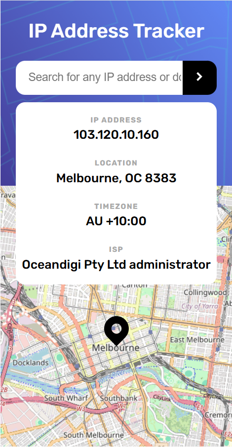

# Frontend Mentor - IP address tracker solution

This is a solution to the [IP address tracker challenge on Frontend Mentor](https://www.frontendmentor.io/challenges/ip-address-tracker-I8-0yYAH0). Frontend Mentor challenges help you improve your coding skills by building realistic projects. 

## Table of contents

- [Overview](#overview)
  - [The challenge](#the-challenge)
  - [Screenshot](#screenshot)
  - [Links](#links)
- [My process](#my-process)
  - [Built with](#built-with)
  - [What I learned](#what-i-learned)
  - [Continued development](#continued-development)
  - [Useful resources](#useful-resources)
- [Author](#author)
- [Acknowledgments](#acknowledgments)

**Note: Delete this note and update the table of contents based on what sections you keep.**

## Overview

### The challenge

Users should be able to:

- View the optimal layout for each page depending on their device's screen size
- See hover states for all interactive elements on the page
- See their own IP address on the map on the initial page load
- Search for any IP addresses or domains and see the key information and location

### Screenshot




### Links

- Solution URL: [solution in GitHub](https://github.com/Ekin-shieh/ip-address-tracker)
- Live Site URL: [live page in GitPage](https://ekin-shieh.github.io/ip-address-tracker/)

## My process

### Built with

- Semantic HTML5 markup
- CSS custom properties
- Flexbox
- CSS Grid
- Mobile-first design approach
- JavaScript (no framework)
- Leaflet.js (for map rendering and interaction)
- IP geolocation API (ipapi.co, ipapi.is)

### What I learned

- How to use fetch() to asynchronously obtain geographic information of IP addresses
- How to query IP or domain name based on user input and update the map and information panel synchronously
- Use Leaflet to render maps and dynamically set center locations and markers
- How to handle the multi-interface logic of IP API (for local IP query and specified IP query respectively)
- Implement fallback default logic when API request fails to avoid program crashes
- Use display: grid and auto line height design to achieve dynamic adaptation of some areas

To see how you can add code snippets, see below:

Dynamically request the API and update the map center point:

```js
const url = `https://api.ipapi.is/?ip=${ip}`
const res = await fetch(url)
const re = await res.json()

updateMap(re.location.latitude, re.location.longitude)
```
Extract time zone offset:

```js
function extractUTCOffset(localTimeStr) {
  const match = localTimeStr.match(/([+-]\d{2}:\d{2})$/)
  return match ? `UTC ${match[1]}` : 'UTC'
}
```

### Continued development

- Add error prompts and highlights to input boxes (such as entering illegal IP addresses)
- Optimize map interactions, such as reverse geocoding after dragging the map
- Connect to the city name auto-completion function
- Add support for dark mode switching
- Try to refactor the project with TypeScript to improve type safety

## Author

- Frontend Mentor - [@Ekin-shieh](https://www.frontendmentor.io/profile/Ekin-shieh)
- GitHub - [@Ekin-shieh](https://github.com/Ekin-shieh)